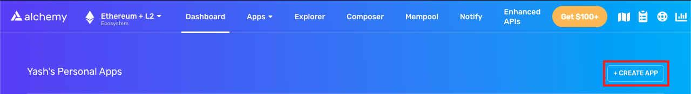
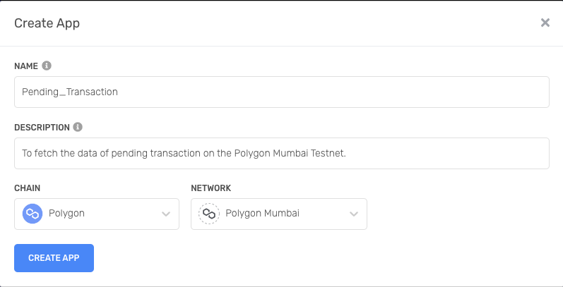
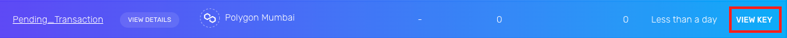
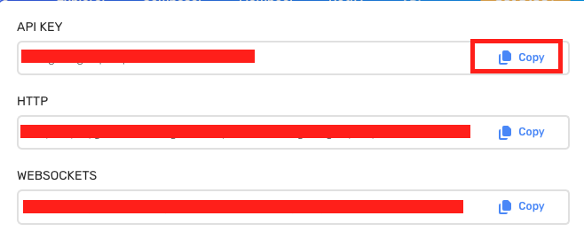
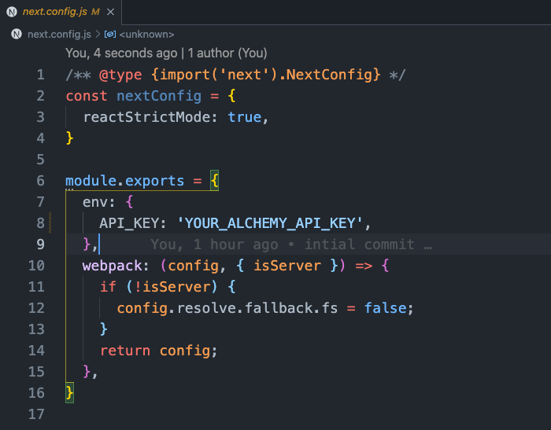

# <a href="https://pending-txn.vercel.app/">Pending Transaction</a>

This <strong>Next App</strong> fetch the pending transactions on the Polygon Testnet using the Alchemy Node.

<br>

# Parameters 

* Transaction Hash
* Sender's Address 
* Receiver's Address

<hr>
<br>

<br>

# Set Up on your machine

### Open Your Terminal

<br>

### `cd` to the folder you want to start the project.

<br>

### Clone the Repository

```
git clone https://github.com/Megabyte-143/pending_txn.git
```

<br>

### Go to the <a href="https://dashboard.alchemyapi.io/">Alchemy</a>

<br>

### Create a new App

</img>

<br>

### Select the `Polygon Chain` and `Mumbai Testnet`

</img>

<br>

### Create the APP.

<br>

### Click on the view

</img>

<br>

### Copy the API Key

</img>

<br>

### Paste the `API Key` in the `next.config.js`

</img>

<br>

### Run the App

```
npm run dev
```

<br>
<br>

# For Any Queries
<div align="center">
<a href="https://t.me/+kJl1BmcgYfo2YzM1"> </a></div>

